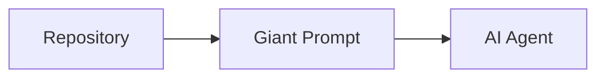
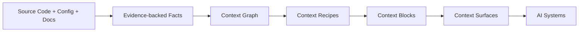
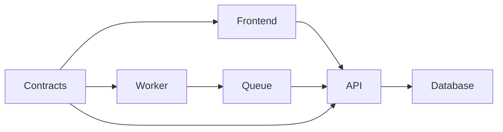
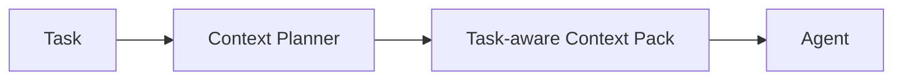

# AgentCtx Influential Docs Update Plan

## Purpose

Update the AgentCtx V2 docs to become:
- technically influential
- benchmark-backed
- visually compelling
- enterprise-relevant
- highly shareable

The docs must strongly communicate:

Current state:
repo -> giant prompt -> agent

AgentCtx state:
repo
  -> semantic context compiler
  -> operational context infrastructure
  -> task-aware context surfaces
  -> autonomous engineering systems

The docs should repeatedly reinforce:

- the missing operational context layer
- context coordination as the bottleneck
- token efficiency as architectural
- evidence-backed context
- public-safe AI surfaces
- measurable benchmark improvements

---

# Strategic Messaging

## Primary Tagline

Any team. Any framework. Any repo.

## Primary Positioning

AgentCtx is context infrastructure for autonomous software engineering systems.

## Expanded Positioning

AgentCtx scans repositories, extracts evidence-backed operational facts, builds a graph of system relationships, compiles task-aware context, applies visibility and security policies, and renders context surfaces for coding agents, CI systems, review agents, docs crawlers, and future autonomous engineering workflows.

---

# Main Industry Problem

Most AI engineering workflows still operate like:

repo -> giant prompt -> agent

This forces AI systems to repeatedly:
- rediscover architecture
- infer operational boundaries
- infer workflows
- reload large irrelevant context
- waste tokens
- hallucinate structure
- drift away from repository reality

This scales poorly for:
- monorepos
- enterprise systems
- polyglot architectures
- autonomous workflows

The missing layer is:
operational context coordination.

---

# The AgentCtx Model

AgentCtx replaces:

files -> templates -> markdown

with:

files
  -> evidence-backed facts
  -> context graph
  -> context recipes
  -> semantic context blocks
  -> context surfaces
  -> AI systems

This transforms AI engineering from:
context reconstruction

into:
context consumption.

---

# Public Example Strategy

The docs should use realistic systems that demonstrate:
- operational complexity
- token-heavy workflows
- monorepo scaling
- public/private boundaries
- measurable improvements

---

# Best Public Example Categories

## 1. CMS / Content Platform

Demonstrates:
- plugins
- APIs
- frontend/backend separation
- permissions
- public/private context
- token-heavy docs

Pages:
- docs/examples/cms-platform.md
- docs/examples/cms-benchmarks.md
- docs/examples/cms-public-context.md

Benchmark focus:
- token reduction
- plugin boundary correctness
- security findings
- runtime improvements

---

## 2. Polyglot Monorepo

Example:
- Angular frontend
- .NET API
- Node workers
- shared contracts

Demonstrates:
- Context Points
- Context Mesh
- framework adapters
- task-aware planning

Pages:
- docs/examples/polyglot-monorepo.md
- docs/examples/angular-dotnet.md
- docs/examples/context-mesh.md

---

## 3. Ecommerce Platform

Demonstrates:
- payments
- auth
- inventory
- workers
- security-sensitive boundaries

Pages:
- docs/examples/ecommerce-platform.md
- docs/examples/ecommerce-security.md

---

## 4. Internal Developer Platform

Demonstrates:
- CI agents
- deployment tooling
- observability
- platform workflows

Pages:
- docs/examples/internal-platform.md
- docs/examples/ci-agents.md

---

## 5. API Platform

Demonstrates:
- llms.txt
- public-safe surfaces
- OpenAPI
- contracts
- SDKs

Pages:
- docs/examples/api-platform.md
- docs/examples/public-context.md

---

# Public Examples Must Emphasize

## Token Reduction

Example visual:

Full repo context:
120k tokens

AgentCtx task-aware context:
12k tokens

Use:
- token charts
- density charts
- duplicate reduction visuals

---

## Context Planning

Example:

Task:
Fix frontend auth bug

Loaded:
- routes.md
- security.md
- auth.md

Excluded:
- queues.md
- deployments.md
- database.md

This visually demonstrates:
- operational awareness
- token optimization
- scoped context

---

## Public-Safe Surfaces

Examples should strongly demonstrate:

Internal:
- AGENTS.md
- CLAUDE.md
- security.md

Public:
- llms.txt
- public-manifest.json
- public architecture

This becomes a major enterprise differentiator.

---

# Visual Communication Strategy

The docs should visually explain:
- the current broken model
- the AgentCtx model
- token flow
- context planning
- context mesh relationships
- benchmark evidence

---

# Visualization Stack

## Primary

Mermaid:
- architecture diagrams
- context mesh
- flows
- sequence diagrams

## Advanced

D3.js:
- interactive context graphs
- token flow
- benchmark telemetry
- context usage visualization

## Charts

Observable Plot or Plotly:
- token charts
- runtime charts
- benchmark comparisons

---

# Required Diagrams

## Current State

## AgentCtx State

## Context Mesh

## Context Planning

---

# Benchmark Storytelling

Benchmarks become proof.

Pages:
- docs/bench/overview.md
- docs/bench/cms-example.md
- docs/bench/polyglot-example.md

Every benchmark must include:
- methodology
- fixtures
- token usage
- runtime
- file accuracy
- security findings
- limitations
- reproducibility

Example table:

| Metric | No Context | AgentCtx |
|---|---:|---:|
| Success | 42% | 82% |
| Tokens | 92k | 38k |
| Runtime | 14m | 8m |
| Security Findings | 3 | 0 |

---

# Homepage UX

Hero:
Context infrastructure for autonomous software engineering systems.

Subheading:
Compile repositories into structured, secure, token-efficient operational context for coding agents, CI systems, review agents, docs crawlers, and future autonomous engineering workflows.

Primary CTA:
pnpm dlx agentctx init

Secondary CTAs:
- Why AgentCtx
- Explore Benchmarks
- View Framework Support

---

# Top-Level Navigation

- Why AgentCtx
- Architecture
- Frameworks
- Bench
- CLI
- Docs
- GitHub

---

# Required Docs Pages

docs/
  why-agentctx.md

  architecture/
    overview.md
    compiler-pipeline.md
    semantic-context-compiler.md
    context-surfaces.md
    performance.md
    telemetry.md

  concepts/
    context-lexicon.md
    context-facts.md
    context-graph.md
    context-points.md
    context-mesh.md
    context-slices.md
    context-recipes.md
    context-block-ir.md
    context-manifest.md
    context-packs.md
    token-density.md

  llms/
    overview.md
    llms-txt.md
    llms-full.md
    public-manifest.md
    external-consumers.md

  frameworks/
    support-matrix.md
    angular/
    dotnet/
    node/
    react/
    next/

  bench/
    overview.md
    methodology.md
    scoring.md
    reports.md

---

# Docs Deployment

Use:
- VitePress
- GitHub Pages

Expected URL:
https://<github-org>.github.io/<repo-name>/

---

# Docs Development Batches

## Batch 1
- homepage rewrite
- current-state vs AgentCtx-state diagrams
- benchmark preview
- install CTA

## Batch 2
- Why AgentCtx
- industry problem
- operational context layer
- research-backed messaging

## Batch 3
- visual architecture
- context mesh diagrams
- context planning visuals
- token flow visuals

## Batch 4
- CMS example
- polyglot monorepo example
- ecommerce example
- internal platform example
- API platform example

## Batch 5
- benchmark pages
- methodology
- reproducibility
- benchmark charts
- raw evidence

## Batch 6
- token and performance docs
- context planning docs
- density scoring docs
- duplicate detection examples

## Batch 7
- public-safe context docs
- llms.txt docs
- visibility classification docs
- security diagrams

## Batch 8
- framework support matrix
- Angular docs
- .NET docs
- Node docs
- adapter architecture

---

# Final Messaging

The docs should repeatedly reinforce:

AgentCtx gives AI systems the same operational understanding that senior engineers rely on to safely work inside complex software systems.

And:

The future bottleneck is context coordination.
AgentCtx exists to solve that missing infrastructure layer.
