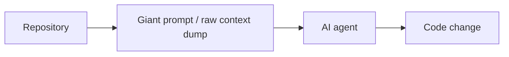
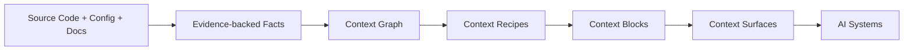
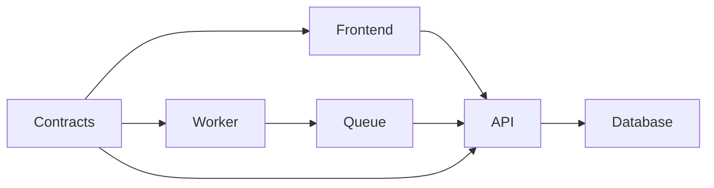
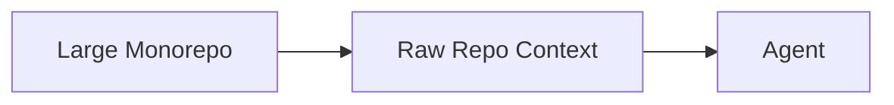
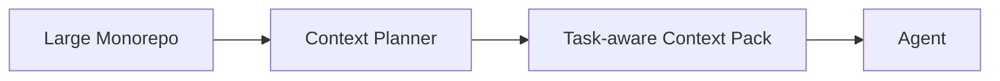

# AgentCtx V2 Documentation and Marketing Strategy Plan
## Research-Backed Context Infrastructure for Autonomous Software Engineering Systems

# Purpose

This plan redesigns the AgentCtx V2 documentation strategy so the docs site becomes both:

```text
1. The primary marketing site
2. A technically credible engineering reference
```

The documentation must:

- explain the market problem clearly
- explain the missing infrastructure layer
- visually communicate the architectural shift
- support claims with research and benchmark evidence
- appeal to CTOs and senior engineering teams
- feel like serious infrastructure tooling
- avoid hype-driven AI marketing language

The docs should position AgentCtx as:

```text
Context infrastructure for autonomous software engineering systems.
```

---

# Core Strategic Positioning

## Primary Tagline

```text
Any team. Any framework. Any repo.
```

## Primary Product Positioning

```text
AgentCtx is a semantic context compiler that transforms repositories into structured, secure, token-efficient operational context for AI systems.
```

## Expanded Positioning

```text
AgentCtx scans repositories, extracts evidence-backed operational facts, builds a graph of system relationships, compiles task-aware context, applies visibility and security policies, and renders context surfaces for coding agents, CI systems, review agents, docs crawlers, and future autonomous engineering workflows.
```

---

# The Main Industry Problem

This section becomes one of the most important parts of the docs.

Create:

```text
docs/why-agentctx.md
```

The docs must explain:

## Current AI Engineering Flow



This model forces AI systems to repeatedly:

- rediscover architecture
- infer operational boundaries
- infer security rules
- infer ownership
- infer workflows
- load large irrelevant context windows
- re-learn repositories from scratch

This creates:

- token waste
- hallucinated architecture
- inconsistent understanding
- unsafe edits
- poor monorepo scalability
- duplicated context loading

---

# Research-Backed Problem Framing

The docs should support claims using published research and clearly explain that AgentCtx is designed to address those issues.

## Key research-backed themes

### Long context is not automatically reliable

Research such as:

```text
Lost in the Middle: How Language Models Use Long Contexts
```

shows that relevant information buried inside long contexts is often not used effectively.

This supports the argument that:

```text
larger prompts are not a scalable operational strategy
```

Docs wording:

```text
Modern coding agents often rely on extremely large context windows, but long-context research shows that models do not consistently use information effectively when relevant details are buried inside large prompts.
```

---

### Repository-level coding remains difficult

Repository-level code generation research repeatedly highlights:

- dependency understanding
- architecture awareness
- context selection
- cross-file reasoning

as major unsolved challenges.

Docs wording:

```text
The challenge is not only generating code. It is helping AI systems understand the operational structure of real software systems.
```

---

### Retrieval quality matters more than raw volume

Research around retrieval-augmented systems supports:

```text
better retrieval and context selection
```

rather than simply:

```text
more context
```

Docs wording:

```text
AgentCtx is designed to optimize context relevance and operational understanding instead of relying on oversized prompts and raw repository dumps.
```

---

# The AgentCtx Model

This becomes the central architecture visual.



Supporting explanation:

```text
AgentCtx compiles software systems into structured operational context instead of forcing every AI system to rediscover repository understanding independently.
```

---

# The Core Strategic Shift

The docs must repeatedly explain this transition:

## Before

```text
repo -> giant prompt -> agent
```

## After

```text
repo
  -> semantic context compiler
  -> operational context infrastructure
  -> task-aware context surfaces
  -> autonomous engineering systems
```

The key message:

```text
AgentCtx transforms AI engineering from context reconstruction into context consumption.
```

---

# Context Points

This is one of the most unique concepts in the framework.

## Definition

A Context Point is:

```text
a bounded operational domain within a software system
```

Examples:

- frontend
- api
- worker
- shared-contracts
- database
- infra

## Why Context Points Matter

Without Context Points:

```text
agents load entire repositories
```

This causes:

- large prompts
- token waste
- irrelevant context
- hallucinations
- unsafe changes

With Context Points:

```text
agents load only the operational domain relevant to the task
```

This improves:

- performance
- token efficiency
- task focus
- monorepo scalability
- operational safety

---

# Context Mesh

The Context Mesh models relationships between systems.

Example:



Supporting explanation:

```text
The Context Mesh models operational relationships and dependencies between systems so agents can reason about repositories more like senior engineers do.
```

---

# Context Blocks

AgentCtx does not generate generic summaries.

It generates:

```text
semantic operational context blocks
```

A Context Block is:

- evidence-backed
- task-aware
- token-aware
- visibility-aware
- operationally meaningful

Example:

```md
# Security

## What matters

- Admin routes require authGuard.
- Billing endpoints require JWT validation.

## Rules for agents

- Do not bypass middleware.
- Do not hardcode credentials.

## High-risk files

- auth.guard.ts
- AuthMiddleware.cs
```

The docs should explain why this is better than:

- giant prompts
- embeddings chunks
- raw file dumps
- naive summaries

---

# Context Surfaces

Different systems should not receive the same context.

AgentCtx introduces:

```text
public
internal
sensitive
secret
```

visibility classifications.

## Internal Agent Context

For:

- Claude
- Codex
- Cursor
- Copilot
- CI agents

Outputs:

```text
AGENTS.md
CLAUDE.md
.cursor/rules/*.mdc
```

## Public-Safe Context

For:

- llms.txt
- external AI systems
- docs crawlers

Outputs:

```text
llms.txt
llms-full.txt
public-manifest.json
```

The docs should explain that this distinction is one of the major enterprise differentiators of the framework.

---

# Token Efficiency Messaging

The docs must position token efficiency as architectural.

Create:

```text
docs/concepts/token-density.md
```

Explain:

AgentCtx actively reduces:

- duplicated context
- irrelevant context
- oversized prompts
- stale context

Features:

- token budgets
- context planning
- token density scoring
- duplicate detection
- context packs
- context usage audits

---

# Visual Token Reduction Diagram



versus:



Supporting explanation:

```text
AgentCtx reduces token usage by planning and compiling task-relevant operational context instead of forcing agents to consume entire repositories.
```

---

# Benchmark Storytelling

Benchmarks become proof.

Create:

```text
docs/bench/overview.md
```

Positioning:

```text
AgentCtx Bench measures whether structured context improves AI engineering outcomes.
```

Metrics:

- task success
- token usage
- runtime
- file accuracy
- security findings
- irrelevant edits

Every benchmark page must include:

- methodology
- fixtures
- limitations
- raw evidence
- reproducibility notes

---

# Example Benchmark Visual

| Metric | No Context | AgentCtx |
|---|---:|---:|
| Success | 42% | 82% |
| Tokens | 92k | 38k |
| Runtime | 14m | 8m |
| Security Findings | 3 | 0 |

Supporting explanation:

```text
AgentCtx Bench provides measurable evidence instead of vague productivity claims.
```

---

# Performance Messaging

Create:

```text
docs/architecture/performance.md
```

Explain:

AgentCtx is designed for:

- incremental builds
- parallel extractors
- affected builds
- lazy context loading
- recipe-level caching
- deterministic rendering
- streaming telemetry

Performance targets:

```text
small repo build < 1s
medium repo build < 5s
large monorepo = incremental only
```

---

# Extensibility Messaging

The docs should strongly communicate flexibility.

Positioning:

```text
Any team. Any framework. Any repo.
```

Explain:

The core compiler remains framework-agnostic.

Framework-specific understanding is added through adapters.

Examples:

- Angular
- .NET
- Node
- React
- Next.js
- Workers
- Shared contracts

Adapters emit:

- facts
- evidence
- confidence
- visibility

not Markdown.

This keeps the core:

- extensible
- maintainable
- future-proof

---

# Documentation Site UX

The docs should feel:

```text
technical
high-signal
modern
observability-oriented
infrastructure-grade
```

Use:

```text
VitePress + GitHub Pages
```

---

# Homepage Hero

```text
Context infrastructure for autonomous software engineering systems.
```

## Subheading

```text
Compile repositories into structured, secure, token-efficient operational context for coding agents, CI systems, review agents, docs crawlers, and future autonomous engineering workflows.
```

## Primary CTA

```bash
pnpm dlx agentctx init
```

## Secondary CTAs

```text
Why AgentCtx
Explore Benchmarks
View Framework Support
```

---

# Top-Level Navigation

```text
Why AgentCtx
Architecture
Frameworks
Bench
CLI
Docs
GitHub
```

---

# Required Documentation Pages

```text
docs/
  why-agentctx.md

  architecture/
    overview.md
    compiler-pipeline.md
    semantic-context-compiler.md
    context-surfaces.md
    performance.md
    telemetry.md

  concepts/
    context-lexicon.md
    context-facts.md
    context-graph.md
    context-points.md
    context-mesh.md
    context-slices.md
    context-recipes.md
    context-block-ir.md
    context-manifest.md
    context-packs.md
    token-density.md

  llms/
    overview.md
    llms-txt.md
    llms-full.md
    public-manifest.md
    external-consumers.md

  frameworks/
    support-matrix.md
    angular/
    dotnet/
    node/
    react/
    next/

  cli/
    init.md
    build.md
    sync.md
    check.md
    context-plan.md
    tokens.md
    bench.md

  security/
    redaction.md
    public-safe-context.md
    context-boundaries.md

  bench/
    overview.md
    methodology.md
    scoring.md
    reports.md

  runner/
    dual-agent-runner.md
```

---

# Documentation Quality Standard

Every major page should answer:

```text
What problem does this solve?
Why does it matter?
How does it improve operational understanding?
How does it reduce token usage?
How does it improve performance?
How does it improve safety?
How do agents consume it?
How do external systems consume it?
How is it benchmarked?
What research or evidence supports the claim?
```

---

# Final Messaging

The docs should repeatedly reinforce:

```text
AgentCtx gives AI systems the same operational understanding that senior engineers rely on to safely work inside complex software systems.
```

And:

```text
The future bottleneck is context coordination.
AgentCtx exists to solve that missing infrastructure layer.
```
